# Community Assistant - Architecture

Visual documentation using Mermaid diagrams. Each document is focused and easy to update.

## 📚 Documentation

### **[Inquiry Flow](docs/inquiry-flow.md)**
How board members respond to email inquiries via chat.
- Simple sequence diagram
- Shows the feature we just built
- 2-minute read

### **[Component Map](docs/component-map.md)**
Visual map of all Akka SDK components in the system.
- Mind map overview
- Components by type
- File locations

### **[Chat Interface Architecture](CHAT_INTERFACE_ARCHITECTURE.md)** *(Future)*
Detailed architectural design for multi-agent topic-centric chat system.
- Not yet implemented
- Research and design document
- Foundation for future features

## Quick System Overview

```mermaid
flowchart LR
    Gmail[📧 Gmail] -->|Automatic Polling| Workflow[EmailProcessingWorkflow]
    Timer[⏰ EmailPollingAction] -->|Every 5 min| Workflow
    Workflow --> Entity[EmailEntity]
    Entity --> Views[Views]
    Entity --> Consumer[GoogleSheetConsumer]
    Consumer --> Sheets[📊 Google Sheets]
    Board[👤 Board Member] -->|Natural Language| ChatAI[ChatHandlerAIAgent]
    Board -->|Keywords| Chat[ChatHandlerAgent]
    Board -->|Manual Trigger| HTTP[EmailEndpoint]
    HTTP --> Workflow
    ChatAI --> Entity
    Chat --> Views
    Chat --> Entity

    style Gmail fill:#e1f5ff
    style Board fill:#e1f5ff
    style Sheets fill:#e1f5ff
    style ChatAI fill:#fff3e0
    style Timer fill:#f3e5f5
    style HTTP fill:#e8f5e8
```



## Component Count

| Type | Count | Examples |
|------|-------|----------|
| **EventSourced Entities** | 1 | EmailEntity |
| **KeyValue Entities** | 3 | SheetSyncBufferEntity, EmailSyncCursorEntity, EmailPollingConfigEntity |
| **Agents** | 3 | ChatHandlerAgent (lofi), ChatHandlerAIAgent (AI), EmailTaggingAgent |
| **Workflows** | 1 | EmailProcessingWorkflow |
| **Views** | 2 | InquiriesView, TopicsView |
| **Consumers** | 1 | GoogleSheetConsumer |
| **TimedActions** | 3 | SheetSyncFlushAction, EmailPollingAction, ReminderAction |
| **HTTP Endpoints** | 2 | ChatEndpoint, EmailEndpoint |

## Email Polling System

The system automatically fetches new emails from Gmail every 5 minutes:


**Environment Configuration:**
- **Production**: Automatic polling enabled (5-minute default)
- **Test Environment**: Polling disabled, manual processing via HTTP endpoint
- **Configurable**: Interval via `EMAIL_POLLING_INTERVAL` environment variable

**Key Components:**
- `EmailPollingAction` - Timer that triggers polling
- `EmailPollingConfigEntity` - Stores configurable interval
- `ServiceConfiguration` - Bootstrap with environment-based enabling

## Gmail Integration Status

**✅ FULLY IMPLEMENTED** - Real Gmail integration is production-ready with comprehensive testing.

### Service Selection Strategy
The system automatically selects the appropriate email service based on available credentials:

```mermaid
flowchart TD
    Start[System Startup] --> Check{Gmail Credentials<br/>Available?}
    Check -->|Yes| Gmail[GmailInboxService<br/>📧 Real Gmail API]
    Check -->|No| Mock[MockEmailInboxService<br/>🧪 Test Double]
    Gmail --> Features[✅ OAuth Authentication<br/>✅ Domain-wide Delegation<br/>✅ Automatic Polling<br/>✅ Production Observability]
    Mock --> TestFeatures[✅ Test Isolation<br/>✅ Predictable Behavior<br/>✅ No External Dependencies]
```



### Implementation Details
- **Real Gmail**: Uses Google Service Account with domain-wide delegation
- **Authentication**: OAuth 2.0 with service account credentials  
- **API Integration**: Gmail API v1 with proper error handling
- **Observability**: External service call logging for monitoring
- **Testing**: Multi-layer integration tests verify complete polling flow

### Testing Coverage
| Layer | Description | Status |
|-------|-------------|---------|
| **Layer 1** | Service selection (Gmail vs Mock) | ✅ Verified |
| **Layer 2** | Workflow-level Gmail integration | ✅ Verified |
| **Layer 3** | Complete timer-based polling flow | ✅ Verified |

### Configuration Requirements
```bash
# Production Gmail Integration
GOOGLE_APPLICATION_CREDENTIALS=/path/to/service-account.json
GMAIL_USER_EMAIL=styrelsen@yourdomain.com
EMAIL_POLLING_ENABLED=true

# Test Environment (uses Mock)
# Omit credentials to use MockEmailInboxService
EMAIL_POLLING_ENABLED=false
```

## Board Member Chat Interaction

Two approaches for handling board member responses to inquiries:

```mermaid
graph TD
    BoardMsg["👤 Board Member Message<br/>'I've contacted the plumber.<br/>They'll come tomorrow at 9 AM.'"]

    BoardMsg -->|Option 1| LoFi[ChatHandlerAgent<br/>âš¡ Pattern Matching]
    BoardMsg -->|Option 2| AI[ChatHandlerAIAgent<br/>🤖 Natural Language]

    LoFi -->|"Looks for '@assistant' keyword"| LoFiAction[Mark as Addressed]
    AI -->|"AI understands intent"| AIAction[Mark as Addressed]

    LoFiAction --> Entity[EmailEntity]
    AIAction --> Entity

    Entity --> LoFiReply["Fixed: 'Noted. The inquiry<br/>has been marked as addressed.'"]
    Entity --> AIReply["Natural: 'Thank you for your<br/>prompt action in addressing<br/>the resident's inquiry.'"]

    style LoFi fill:#e8f5e9
    style AI fill:#fff3e0
    style BoardMsg fill:#e1f5ff
```



**When to use:**
- **ChatHandlerAgent (LoFi)**: Fast, deterministic, keyword-based (current default)
- **ChatHandlerAIAgent (AI)**: Natural language understanding, flexible responses (tested with SmolLM2)

## Key Files

**Domain Models** (Pure Java, no Akka):
- `Email.java` - Email with Status (UNPROCESSED/ADDRESSED)
- `EmailTags.java` - AI-generated tags
- `SheetRow.java` - Google Sheets format

**Infrastructure** (External APIs):
- `GmailInboxService.java` - Gmail API client
- `GoogleSheetSyncService.java` - Sheets API client

## Critical Maintenance Note

**When adding new EmailEntity events:**

You MUST update these 3 files or you'll get compilation errors:

1. `TopicsView.java:29` - Add case in switch statement
2. `InquiriesView.java:26` - Add case in switch statement
3. `GoogleSheetConsumer.java:36` - Add case in switch statement

All three consume `EmailEntity.Event` and have exhaustive switch statements.

## Testing Strategy

See **[Testing Strategy](TESTING_STRATEGY.md)** for the three-tier testing approach:
- Fake Agent (unit tests)
- Nano LLM (integration tests)
- Real LLM (E2E tests)

---

*Keep diagrams focused and simple. Create new docs for new features.*
