# Community Assistant - Architecture

Visual documentation using Mermaid diagrams. Each document is focused and easy to update.

## 📚 Documentation

### **[Inquiry Flow](docs/inquiry-flow.md)**
How board members respond to email inquiries via chat.
- Simple sequence diagram
- Shows the feature we just built
- 2-minute read

### **[Component Map](docs/component-map.md)**
Visual map of all Akka SDK components in the system.
- Mind map overview
- Components by type
- File locations

### **[Chat Interface Architecture](CHAT_INTERFACE_ARCHITECTURE.md)** *(Future)*
Detailed architectural design for multi-agent topic-centric chat system.
- Not yet implemented
- Research and design document
- Foundation for future features

## Quick System Overview

```mermaid
flowchart LR
    Gmail[📧 Gmail] --> Workflow[EmailProcessingWorkflow]
    Workflow --> Entity[EmailEntity]
    Entity --> Views[Views]
    Entity --> Consumer[GoogleSheetConsumer]
    Consumer --> Sheets[📊 Google Sheets]
    Board[👤 Board Member] --> Chat[ChatHandlerAgent]
    Chat --> Views
    Chat --> Entity

    style Gmail fill:#e1f5ff
    style Board fill:#e1f5ff
    style Sheets fill:#e1f5ff
```

## Component Count

| Type | Count | Examples |
|------|-------|----------|
| **EventSourced Entities** | 1 | EmailEntity |
| **KeyValue Entities** | 2 | SheetSyncBufferEntity, EmailSyncCursorEntity |
| **Agents** | 2 | ChatHandlerAgent, EmailTaggingAgent |
| **Workflows** | 1 | EmailProcessingWorkflow |
| **Views** | 2 | InquiriesView, TopicsView |
| **Consumers** | 1 | GoogleSheetConsumer |
| **TimedActions** | 1 | SheetSyncFlushAction |
| **HTTP Endpoints** | 2 | ChatEndpoint, EmailEndpoint |

## Key Files

**Domain Models** (Pure Java, no Akka):
- `Email.java` - Email with Status (UNPROCESSED/ADDRESSED)
- `EmailTags.java` - AI-generated tags
- `SheetRow.java` - Google Sheets format

**Infrastructure** (External APIs):
- `GmailInboxService.java` - Gmail API client
- `GoogleSheetSyncService.java` - Sheets API client

## Critical Maintenance Note

**When adding new EmailEntity events:**

You MUST update these 3 files or you'll get compilation errors:

1. `TopicsView.java:29` - Add case in switch statement
2. `InquiriesView.java:26` - Add case in switch statement
3. `GoogleSheetConsumer.java:36` - Add case in switch statement

All three consume `EmailEntity.Event` and have exhaustive switch statements.

## Testing Strategy

See **[Testing Strategy](TESTING_STRATEGY.md)** for the three-tier testing approach:
- Fake Agent (unit tests)
- Nano LLM (integration tests)
- Real LLM (E2E tests)

---

*Keep diagrams focused and simple. Create new docs for new features.*
