# Community Assistant - Architecture

Visual documentation using Mermaid diagrams. Each document is focused and easy to update.

## 📚 Documentation

### **[Inquiry Flow](docs/inquiry-flow.md)**
How board members respond to email inquiries via chat.
- Simple sequence diagram
- Shows the feature we just built
- 2-minute read

### **[Component Map](docs/component-map.md)**
Visual map of all Akka SDK components in the system.
- Mind map overview
- Components by type
- File locations

### **[Chat Interface Architecture](CHAT_INTERFACE_ARCHITECTURE.md)** *(Future)*
Detailed architectural design for multi-agent topic-centric chat system.
- Not yet implemented
- Research and design document
- Foundation for future features

## Quick System Overview

```mermaid
flowchart LR
    Gmail[📧 Gmail] -->|Automatic Polling| Workflow[EmailProcessingWorkflow]
    Timer[⏰ EmailPollingAction] -->|Every 5 min| Workflow
    Workflow --> Entity[EmailEntity]
    Entity --> Views[Views]
    Entity --> Consumer[GoogleSheetConsumer]
    Consumer --> Sheets[📊 Google Sheets]
    Board[👤 Board Member] -->|Natural Language| ChatAI[ChatHandlerAIAgent]
    Board -->|Keywords| Chat[ChatHandlerAgent]
    Board -->|Manual Trigger| HTTP[EmailEndpoint]
    HTTP --> Workflow
    ChatAI --> Entity
    Chat --> Views
    Chat --> Entity

    style Gmail fill:#e1f5ff
    style Board fill:#e1f5ff
    style Sheets fill:#e1f5ff
    style ChatAI fill:#fff3e0
    style Timer fill:#f3e5f5
    style HTTP fill:#e8f5e8
```

## Component Architecture

| Type | Purpose | Pattern |
|------|---------|---------|
| **EventSourced Entities** | Core business state | Commands → Events → State |
| **KeyValue Entities** | Simple configuration | Direct state updates |
| **Agents** | AI-powered decisions | Prompt engineering with structured output |
| **Workflows** | Multi-step orchestration | Step-based with timeouts and recovery |
| **Views** | Query projections | Event-driven materialized views |
| **Consumers** | Event processing | React to entity events |
| **TimedActions** | Scheduled tasks | Periodic execution with bootstrapping |
| **HTTP Endpoints** | External API | RESTful with ACL protection |

## Email Polling System

The system automatically fetches new emails from Gmail every 5 minutes:

**Architecture Patterns:**
- **Timer-based Orchestration**: EmailPollingAction coordinates polling schedule
- **Environment-aware Bootstrap**: ServiceConfiguration enables/disables based on config
- **Configurable Intervals**: EmailPollingConfigEntity allows runtime adjustment

## Service Selection Architecture

The system uses dependency injection to select between real and mock implementations based on environment:

**Design Principles:**
- **Port-Adapter Pattern**: Domain defines interfaces, infrastructure provides implementations
- **Environment-based DI**: ServiceConfiguration selects implementation at runtime
- **Test Isolation**: Mock services for deterministic testing
- **Production Readiness**: Real services when credentials are configured

## Chat Interface Architecture

Board members interact with the system through @mentions to address inquiries:

```mermaid
graph TD
    BoardMsg["👤 Board Member Message<br/>'@assistant I've contacted the plumber.<br/>They'll come tomorrow at 9 AM.'"]

    BoardMsg --> Handler[ChatHandler Agent]
    Handler --> Analysis[Intent Analysis]
    Analysis --> Action[Mark Inquiry as Addressed]
    Action --> Entity[EmailEntity]
    Entity --> Response[Confirmation Response]

    style BoardMsg fill:#e1f5ff
    style Handler fill:#fff3e0
```

**Architecture Patterns:**
- **Agent-based Processing**: Pluggable chat handlers for different processing needs
- **Intent Recognition**: Parse board member messages to understand desired actions
- **Entity State Updates**: Chat interactions update core business entities
- **Feedback Loop**: System confirms actions back to board members

*Note: Multiple agent implementations available for different testing and production needs*

## Key Files

**Domain Models** (Pure Java, no Akka):
- `Email.java` - Email with Status (UNPROCESSED/ADDRESSED)
- `EmailTags.java` - AI-generated tags
- `SheetRow.java` - Google Sheets format

**Infrastructure** (External APIs):
- `GmailInboxService.java` - Gmail API client
- `GoogleSheetSyncService.java` - Sheets API client

## Critical Maintenance Note

**When adding new EmailEntity events:**

You MUST update these 3 files or you'll get compilation errors:

1. `TopicsView.java:29` - Add case in switch statement
2. `InquiriesView.java:26` - Add case in switch statement
3. `GoogleSheetConsumer.java:36` - Add case in switch statement

All three consume `EmailEntity.Event` and have exhaustive switch statements.

## Testing Strategy

See **[Testing Strategy](TESTING_STRATEGY.md)** for the three-tier testing approach:
- Fake Agent (unit tests)
- Nano LLM (integration tests)
- Real LLM (E2E tests)

---

*Keep diagrams focused and simple. Create new docs for new features.*
