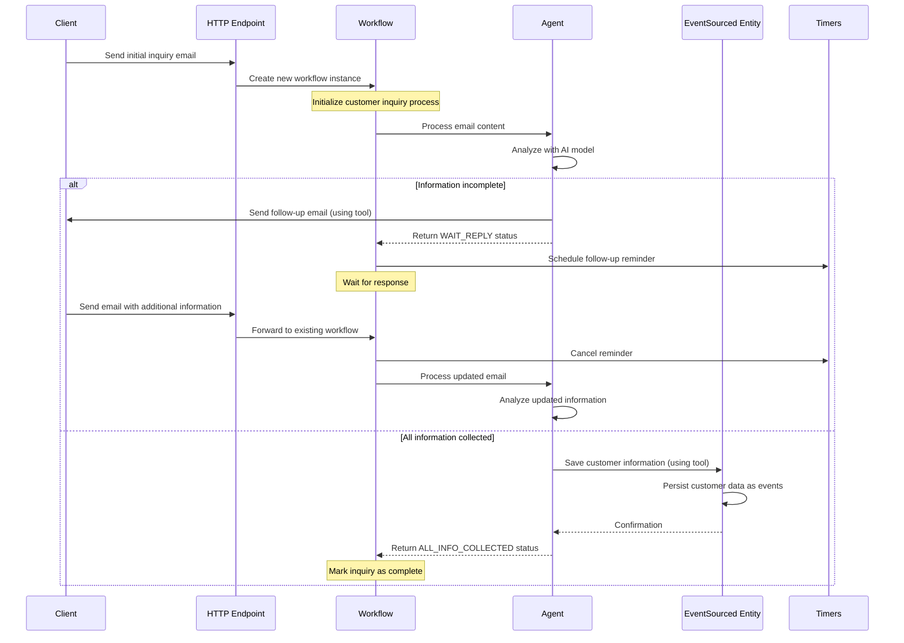

# Real Estate Customer Service Agent

A sample application demonstrating how to build a customer service agent for real estate inquiries,
by combining Akka features and an LLM model.

📐 **Architecture Documentation**: See [ARCHITECTURE.md](ARCHITECTURE.md) for visual diagrams of the current implementation using Mermaid notation.

## Overview

This project illustrates an Agentic workflow for real estate customer service using Akka. The agent:

- Processes incoming email inquiries about real estate properties
- Analyzes the content of email to extract details on what the costumer is looking for
- Provides in-context follow-up responses when needed
- Saves the collected information for further processing

### Akka components

This sample leverages specific Akka components:

- **Agent**: abstracts the interaction with the LLM model and provides memory out-of-the-box for the interactions done the customer. It also provides access to 2 tools: to send customer emails and save customer information. Tool executions requested by the LLM will be automatically invoked.
- **Workflow**: manages the customer inquiry process from the first interaction until all the information is collected, serving as a temporary storage for emails yet to be processed.
- **EventSourced Entity**: used to maintain the customer information details, registering all the updates occurred as a sequence of events.
- **Timers**: are used to schedule tasks that need to be executed at a later time. In this case, a timer is scheduled to send a follow-up with the client if there is no reply within a default time span. 
- **HTTP Endpoint**: used to serve the application endpoints for receiving email inquiries (`/emails`) 


### Typical flow

The following diagram illustrates the typical interaction flow of the Real Estate Customer Service Agent and the way the different Akka Components interact:




## Running the application

### Prerequisites
- Java 21 or higher
- Maven 3.6 or higher

### Build and run

To run the sample, you need to provide an OpenAI API key and provide it as an environment variable:
```shell
export OPENAI_API_KEY=your-openai-api-key
```

Or change the `application.conf` file to use a different model provider.

Build and run the application:
```shell
# Run the application
mvn compile exec:java
```

### Testing the agent

With the application running, you can test the agent using the following endpoints:

Submit an email inquiry:
```shell
curl -i -XPOST --location "http://localhost:9000/emails" \
  --header "Content-Type: application/json" \
  --data '{"sender": "john@example.com", "subject":"Looking to rent T2 in Porto", "content": "Hello, I am looking to rent a T2 in Porto. Can you help me?"}'
```

The agent will likely decide to follow up with an email to ask for more information (your full name, phone number, etc.). Once you provide the missing information:
```shell
curl -i -XPOST --location "http://localhost:9000/emails" \
  --header "Content-Type: application/json" \
  --data '{"sender": "john@example.com", "subject":"Looking to rent T2 in Porto", "content": "My name is John Doe. My number is 911111111. Looking for an apartment."}'
```

The process of information collection should be marked as completed and ready for human follow-up.


## Deployment

You can use the [Akka Console](https://console.akka.io) to create a project and deploy this service. Once you have a project created, follow these steps.

#### Build docker image 

```shell
mvn clean install -DskipTests
```

#### Setup OpenAI API key
```shell
akka secret create generic openai-api --literal key=$OPENAI_API_KEY
```

NOTE: this assumes you have your `$OPENAI_API_KEY` exported as required to run the project, otherwise just pass the value directly.

#### Push image and deploy the service

```shell
akka service deploy real-estate-cs-agent real-estate-cs-agent:<tag-name> \
  --secret-env OPENAI_API_KEY=openai-api/key --push
```

NOTE: the value of OPENAI_API_KEY is set to secret-name/key-name, as defined in the previous command: secret-name=openai-api and key-name=key.


For more information on deployment, refer to [Deploy and manage services](https://doc.akka.io/operations/services/deploy-service.html).

To understand the Akka concepts that are the basis for this example, see [Development Process](https://doc.akka.io/concepts/development-process.html) in the documentation.