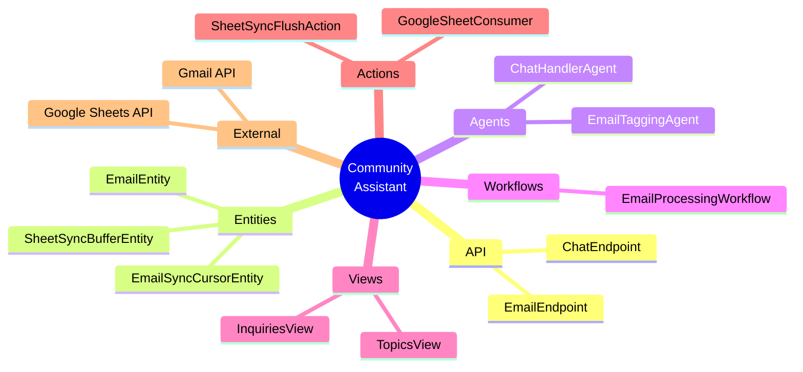
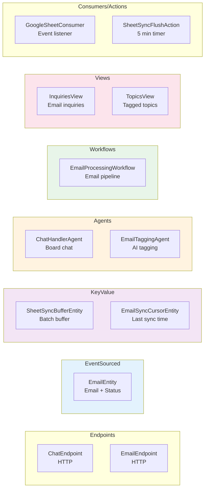
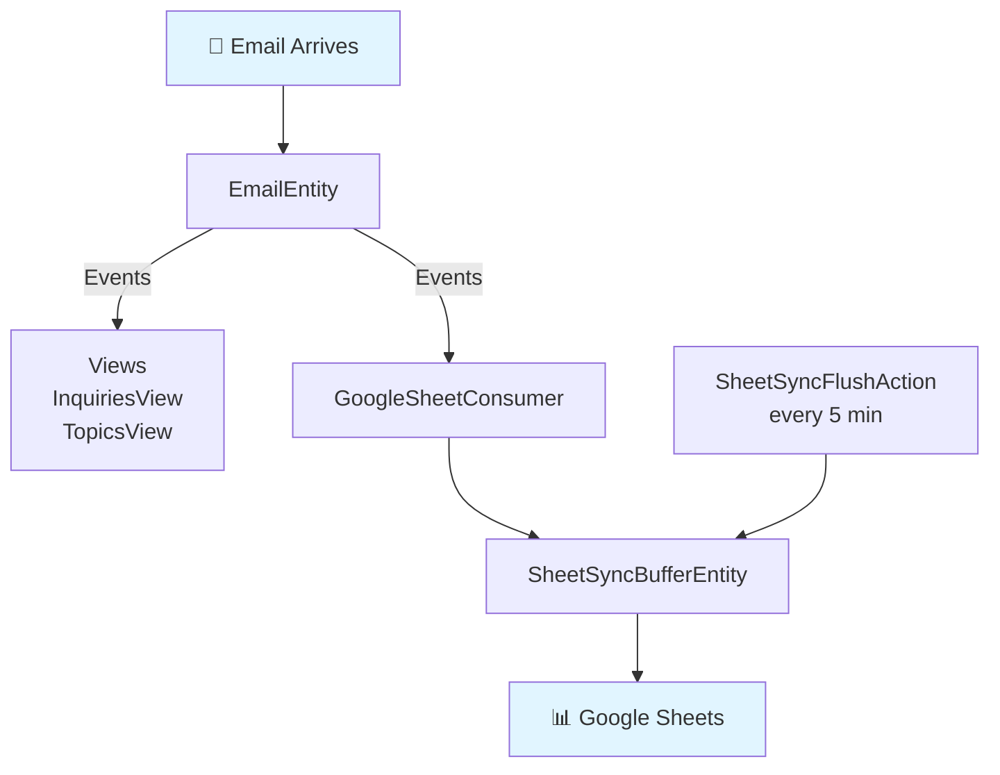

# Component Map - What Exists in the System

Simple visual map of all Akka SDK components.

## Component Types



## By Akka SDK Type



## Quick Reference

### EventSourced Entities (Event Sourcing)
- **EmailEntity** - Email lifecycle with status tracking
  - Events: EmailReceived, TagsGenerated, InquiryAddressed
  - Commands: receiveEmail(), addTags(), markAsAddressed()

### KeyValue Entities (Simple State)
- **SheetSyncBufferEntity** - Buffers rows before Google Sheets sync
- **EmailSyncCursorEntity** - Tracks last processed email timestamp

### Agents (AI)
- **ChatHandlerAgent** - Handles board member @assistant mentions
- **EmailTaggingAgent** - Generates tags/summary/location for emails

### Workflows (Orchestration)
- **EmailProcessingWorkflow** - fetch → store → tag → sync pipeline

### Views (Read Models)
- **InquiriesView** - Projects emails as inquiries for board members
- **TopicsView** - Projects tagged emails as topics

### Consumers (Event Listeners)
- **GoogleSheetConsumer** - Listens to EmailEntity events, buffers to sheets

### TimedActions (Scheduled)
- **SheetSyncFlushAction** - Flushes buffer every 5 minutes

## Event Flow



## File Locations

```
src/main/java/community/
├── api/
│   ├── ChatEndpoint.java          # Board chat interface
│   └── EmailEndpoint.java         # Email processing trigger
├── application/
│   ├── agent/
│   │   ├── ChatHandlerAgent.java  # Board inquiry handler
│   │   └── EmailTaggingAgent.java # AI tagging
│   ├── entity/
│   │   ├── EmailEntity.java       # Email + status
│   │   ├── SheetSyncBufferEntity.java
│   │   └── EmailSyncCursorEntity.java
│   ├── view/
│   │   ├── InquiriesView.java     # Email inquiries
│   │   └── TopicsView.java        # Tagged topics
│   ├── workflow/
│   │   └── EmailProcessingWorkflow.java
│   └── action/
│       ├── GoogleSheetConsumer.java
│       └── SheetSyncFlushAction.java
├── domain/
│   └── model/
│       ├── Email.java             # Email + Status enum
│       ├── EmailTags.java
│       └── SheetRow.java
└── infrastructure/
    ├── gmail/
    │   └── GmailInboxService.java
    └── sheets/
        └── GoogleSheetSyncService.java
```
