# Inquiry Flow - How Board Members Respond to Emails

Simple visualization of the inquiry feature we just built.

## What Happens When an Email Arrives

```mermaid
flowchart TD
    A[📧 Email Arrives] --> B[EmailEntity stores it]
    B --> C[InquiriesView creates inquiry]
    C --> D[📋 Board sees inquiry in view]

    style A fill:#e1f5ff
    style D fill:#e1f5ff
```

## What Happens When Board Member Responds

```mermaid
sequenceDiagram
    participant Board as 👤 Board Member
    participant Agent as ChatHandlerAgent
    participant Entity as EmailEntity

    Note over Board,Entity: Board member replies to inquiry

    Board->>Agent: @assistant I've contacted the plumber
    Note over Agent: Checks session ID pattern:<br/>board-inquiry-session-{emailId}

    Agent->>Entity: markAsAddressed()
    Entity->>Entity: Status: UNPROCESSED → ADDRESSED
    Agent->>Board: "Noted. Inquiry marked as addressed."
```

## Components Involved

| Component | Type | What It Does |
|-----------|------|--------------|
| **EmailEntity** | EventSourcedEntity | Stores email + status (UNPROCESSED/ADDRESSED) |
| **InquiriesView** | View | Shows emails as inquiries (subject + first 50 chars) |
| **ChatHandlerAgent** | Agent | Detects @assistant responses and marks addressed |

## Key Design Decisions

**Session ID Pattern**: `board-inquiry-session-{emailId}`
- Agent uses this to know which email the board member is responding to
- Simple pattern matching (no AI needed for now)

**Two-Level Testing**:
- **Unit Test** (`EmailEntityTest`): Tests `markAsAddressed()` command directly
- **Integration Test** (`ChatHandlerAgentTest`): Tests agent + view + entity working together

## Files Modified

- `Email.java` - Added `Status` enum and `markAsAddressed()` method
- `EmailEntity.java` - Added `InquiryAddressed` event and command
- `ChatHandlerAgent.java` - Added session ID detection and entity call
- `InquiriesView.java` - Projects emails as inquiries
- `TopicsView.java` + `GoogleSheetConsumer.java` - Handle new event

## What's Next?

Future improvements (not yet implemented):
- AI-based topic detection instead of keyword matching
- Actual chat platform integration (Discord/Slack)
- Topic clustering for related emails
